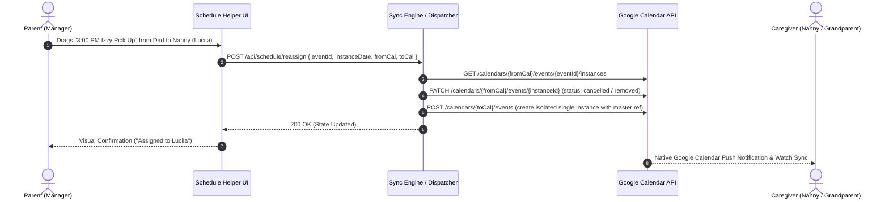
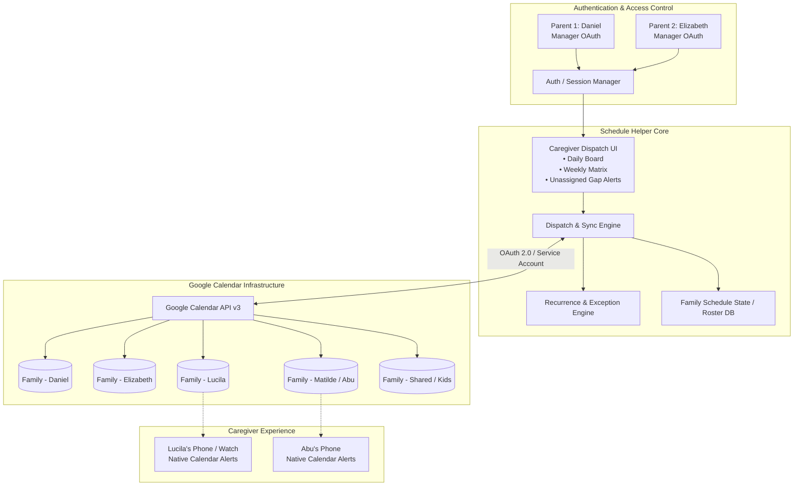

# Google Calendar Schedule Helper: Multi-Caregiver Family Logistics & Dispatch

*A Critical User Journey (CUJ) and system architecture for multi-caregiver households to assign, swap, and synchronize school and activity pickups/drop-offs across shared Google Calendars without recurrence corruption or manual calendar chaos.*

---

## 🔍 The Problem Space

### Context
In active multi-caregiver families (parents, nannies, grandparents, and family helpers), managing children's daily logistics is a complex, high-velocity scheduling puzzle. On any given weekday, multiple children must be transported to and from schools, ballet, chess, gymnastics, sports practices, and tutoring:

- **Stakeholders**: Parents (managing coordinators), In-home Caregivers/Nannies (e.g., Lucila), Grandparents (e.g., Abu / Matilde), and Extended Family.
- **Calendar Infrastructure**: Each adult maintains their own personal and shared Google Calendars (e.g., `Family - Daniel`, `Family - Elizabeth`, `Family - Lucila`, `Family - Matilde`, `Family - Izzy`, `Family - Vale`, `Family - Shared`).
- **Baseline Scheduling**: Routine drop-offs and pick-ups are typically established as repeating/recurring events (e.g., *“Vale School Drop Off @ 8:00 AM, Mon–Fri”*, *“Izzy Chess Pick Up @ 3:00 PM, Tue/Thu”*).

### The Core Friction
Google Calendar was designed for individual calendar owners and business meetings—not dynamic, multi-person operational dispatch. When a family attempts to coordinate daily handoffs, the workflow collapses:

1. **The Recurrence Duplication Trap**: 
   When a parent tries to reassign Tuesday's pickup from the nanny to the grandmother or dad, Google Calendar's native "Copy to Calendar" or drag-and-drop duplicates the *entire recurring series* onto the target calendar. The family ends up with dozens of redundant phantom events and phantom notifications across all calendars.
2. **The Multi-Calendar Blindspot**:
   Looking at 10+ overlapping colored calendars simultaneously creates extreme visual noise (cognitive overload). It is nearly impossible to answer the single most urgent daily question: **"Who is picking up Izzy from gymnastics today at 4:00 PM, and who has Vale?"**
3. **High-Stakes Error Rate & Manual Drag**:
   Reassigning a single pickup currently takes 6–8 manual taps per event: opening the event, detaching the single instance from the recurring series, changing the calendar owner/attendees, deleting the original instance, and verifying the change didn't break future recurrences.
4. **Asymmetric Caregiver Access**:
   Non-manager caregivers (nannies, grandparents) simply need a clean, authoritative view of their daily duties, while parents need full manager-level controls without exposing sensitive personal calendar entries.

---

## 🚦 Critical User Journeys (CUJs)

### CUJ 1: One-Click Caregiver Reassignment & Shift Swapping
* **Statement**: I want to **reassign a specific day's kid pickup or drop-off to a different caregiver with a single tap or drag** while avoiding **manual event duplication, broken recurrence rules, or calendar clutter** so that **our family can adapt to last-minute schedule changes in seconds**.
* **User Scenario**: It is Tuesday afternoon. Daniel is caught in an unexpected work meeting and cannot do the 3:00 PM school pickup for Vale. From his phone, Daniel opens the Schedule Helper, drags today's "Vale School Pick Up" block from his column to Lucila's column, and taps Confirm. The helper updates the Google Calendar instance exception seamlessly—without duplicating next week's repeating series.

### CUJ 2: Consolidated Family Logistics & Dispatch Matrix
* **Statement**: I want to **view a unified, real-time matrix of all children's daily transit commitments alongside assigned caregivers** while avoiding **the visual noise and clutter of 12+ overlapping Google Calendars** so that **both parents always have 100% situational clarity on who is responsible for each child**.
* **User Scenario**: Elizabeth is planning the upcoming Thursday schedule during breakfast. Instead of toggling 8 different calendar checkboxes in the Google Calendar sidebar to piece together coverage, she glances at the Schedule Helper dashboard. The interface clearly highlights an unassigned gap: "Izzy Gymnastics Pick Up (5:30 PM) — Unassigned". She taps "Assign to Abu", and the event is instantly synced to Abu's calendar.

### CUJ 3: Clean Recurrence Exception & Native Calendar Synchronization
* **Statement**: I want to **keep everyone's native Google Calendar app accurate with their exact personal commitments** while avoiding **cloning recurring event series or requiring caregivers to learn a proprietary standalone calendar app** so that **grandparents and nannies receive native phone alerts and Apple Watch / Google Calendar notifications seamlessly**.
* **User Scenario**: Lucila checks her native Google Calendar / Apple Calendar on her phone at 1:00 PM. She sees only her confirmed pickups for the day highlighted in her familiar calendar color, with accurate notifications. Behind the scenes, the Schedule Helper modified only the specific recurrence instance via Google Calendar API without altering the master schedule.

---

## 🗺️ The Ideal Flows

### Flow 1: Fast Single-Instance Caregiver Reassignment

1. **Trigger**: A change in daily availability (e.g., meeting conflict, illness, traffic).
2. **Action**: Manager opens the web UI and reassigns the target duty via a drag-and-drop caregiver board.
3. **Automated Response**: The backend retrieves the specific event recurrence instance, creates a single-instance exception on the target calendar, suppresses the source calendar instance, and logs the assignment.
4. **Resolution**: The child's pickup is covered, native calendar notifications route to the correct caregiver, and no recurring series are duplicated.

### Flow 2: Weekly Dispatch Overview & Gap Detection
1. **Trigger**: Weekly family planning session (e.g., Sunday evening).
2. **Action**: Manager loads the Weekly Dispatch View.
3. **Automated Response**: The system aggregates recurring templates across all family children (`Izzy`, `Vale`) and flags any unassigned drop-offs/pickups with amber warning badges.
4. **Resolution**: Manager batch-assigns caregivers for open slots in under 60 seconds; Google Calendar API executes atomic batch updates.

---

## 🛠️ The Solution: Google Calendar Schedule Helper Architecture

---

## 💻 Under the Hood (Architecture & API Implementation)

### 1. Google Calendar Recurrence Handling Strategy
To avoid the classic Google Calendar bug where moving recurring events clones the entire series, the Schedule Helper implements an **Atomic Recurrence Splitter**:

* **Recurring Master Extraction**: Master events (e.g., `RRULE:FREQ=WEEKLY;BYDAY=MO,TU,WE,TH,FR`) reside on a central master template or the primary family calendar.
* **Instance-Level Exception (`events.instances`)**: When querying for a specific day/week, the engine calls `calendar.events.instances` with `timeMin` and `timeMax` to obtain the precise `instanceId`.
* **Single Occurrence Transfer**: 
  - To move an event from Caregiver A to Caregiver B on date `D`:
    1. Mark the date `D` instance on Calendar A as cancelled (`status: "cancelled"` or add `EXDATE`).
    2. Insert an independent single event on Calendar B for date `D` with a metadata tag `extendedProperties.private.masterSeriesId = originalEventId`.
  - This completely insulates the master recurring rule while ensuring Calendar B receives native reminder notifications.

### 2. Streamlined Multi-Calendar Role & Permission Architecture
* **Manager Role (Parents)**: Authenticates via Google OAuth with `calendar.events` and `calendar.readonly` scopes. Managers have permission to read/write across all configured household calendar IDs.
* **Caregiver Role (Nanny, Grandparents)**: Caregivers do not need to log into the management dashboard unless desired; they simply have their dedicated Google Calendar shared with the manager account. They interact exclusively via their normal phone calendar.

### 3. Dispatch Matrix UI Design
* **Column-by-Caregiver / Column-by-Child View**: Toggle between a Kanban-style daily roster (Columns = Daniel, Elizabeth, Lucila, Matilde) and a Timeline view (Row = Time, Blocks = Kids).
* **Color-Coded Badging**: Visual cues indicate status:
  - 🟢 **Confirmed**: Assigned to an active caregiver.
  - 🟡 **Tentative / Swap Requested**: Awaiting confirmation.
  - 🔴 **Unassigned Gap**: School or activity pickup with no assigned driver.

### 4. Technical Feasibility & Security Assessment
* **OAuth Security**: Minimal necessary scopes (`https://www.googleapis.com/auth/calendar.events` restricted to specified family calendar IDs).
* **Audit Trail**: Every reassignment logs timestamp, manager ID, previous assignee, and new assignee for household accountability.
